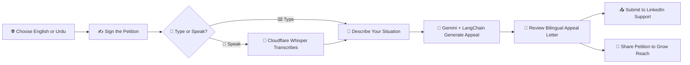

<div align="center">


<br/>


[🔗 Live Demo](https://awaaz-pakistan.vercel.app/en) &nbsp;•&nbsp; [🐙 GitHub Repository](https://github.com/AbdulAzeemHashmi/Awaaz-Pakistan) &nbsp;•&nbsp; [⭐ Star This Repo](https://github.com/AbdulAzeemHashmi/Awaaz-Pakistan/stargazers)

</div>

<br/>

**Awaaz Pakistan** is a community driven advocacy platform that helps Pakistani professionals regain access to their restricted LinkedIn accounts. It combines a collective petition, AI generated bilingual appeal letters, and voice input support, all running on completely free infrastructure with zero credit card requirements.

<div align="center">

</div>

---

## 📋 Table of Contents

1. [🚫 The Problem](#-the-problem)
2. [💡 The Solution](#-the-solution)
3. [🔄 How It Works](#-how-it-works)
4. [🚀 Live Demo](#-live-demo)
5. [🎯 Features](#-features)
6. [🛠️ Tech Stack](#️-tech-stack)
7. [📁 Project Structure](#-project-structure)
8. [⚙️ Setup and Installation](#️-setup-and-installation)
9. [🔑 Environment Variables](#-environment-variables)
10. [🗄️ Database Schema](#️-database-schema)
11. [☁️ Deployment](#️-deployment)
12. [🤝 How to Contribute](#-how-to-contribute)
13. [📄 License](#-license)
14. [🙏 Acknowledgments](#-acknowledgments)

---

## 🚫 The Problem

🔒 LinkedIn's identity verification partner, **Persona**, requires an **NFC enabled e-Passport** to restore a restricted account.

📊 An estimated **99% of Pakistanis** do not hold an NFC enabled e-Passport. Most Pakistani passports simply are not built with the chip this verification method demands.

The result:

- 🚫 Thousands of professionals locked out of accounts they built over years
- 💼 Lost career opportunities, networks, and income tied to LinkedIn
- 🗣️ No accessible path to appeal, since the standard verification method excludes the vast majority of the population
- 🇵🇰 A national identity document, the **CNIC**, issued and verified by **NADRA** and already trusted globally, is simply not accepted as an alternative

> ⚠️ This is not a niche inconvenience. It is a systemic barrier shutting an entire country's workforce out of the platform.

---

## 💡 The Solution

**Awaaz Pakistan** exists to give affected professionals a real, actionable path forward.

✅ **A collective petition**: sign alongside thousands of others to demand LinkedIn accept CNICs and other NADRA verified documents as valid identification
✅ **AI generated appeal letters**: powered by Gemini API and LangChain, generated instantly in English or Urdu
✅ **Voice input support**: speak your situation instead of typing it, powered by Cloudflare Workers AI Whisper
✅ **Full bilingual experience**: complete Urdu right to left (RTL) rendering, not a bolted on translation
✅ **Zero cost infrastructure**: built entirely on free tiers, no credit card required to run or contribute

📌 The goal is simple: turn thousands of individual, ignored complaints into one loud, well documented, unified voice.

---

## 🔄 How It Works

<div align="center">



</div>

---

## 🚀 Live Demo

<div align="center">

### 🔗 [awaaz-pakistan.vercel.app/en](https://awaaz-pakistan.vercel.app/en)

</div>

> 🌐 The live app supports a full language switcher between English and Urdu, including complete RTL layout mirroring for the Urdu interface. Try switching languages on the live demo to see the bilingual experience in action.

---

## 🎯 Features

<div align="center">

| Feature | Icon | Description |
|---|:---:|---|
| **Petition Signing** | ✍️ | Sign the petition with a real time signature counter |
| **AI Appeal Generation** | 🤖 | Generate a professional appeal letter in English or Urdu instantly |
| **Voice Input** | 🎤 | Speak your appeal instead of typing, converted to text automatically |
| **Language Switcher** | 🌐 | Toggle between English and Urdu at any time |
| **Urdu RTL Support** | 🔄 | Full right to left rendering for a native Urdu reading experience |
| **Social Sharing** | 📢 | Share the petition directly to social platforms to grow visibility |
| **Support Request Generator** | 📝 | Generate a pre formatted request ready to submit to LinkedIn support |
| **Zero Cost Infrastructure** | 💰 | Runs entirely on free tier services, no credit card required |

</div>

🎉 Every feature above is live and functional on the deployed demo.

---

## 🛠️ Tech Stack

<div align="center">

| Technology | Purpose | Free Tier Details |
|---|---|---|
| ⚡ **Next.js 16** (App Router) | Frontend framework with TypeScript | Open source, self hosted or deployed free on Vercel |
| ☁️ **Vercel** | Hosting and deployment | Free tier, no credit card required |
| 🗄️ **Supabase PostgreSQL** | Database for signatures and stats | Free tier project, no credit card required |
| 🤖 **Google Gemini API + LangChain** | AI powered appeal generation | Free tier API quota |
| 🎤 **Cloudflare Workers AI Whisper** | Speech to text for voice input | Free tier Workers AI usage |
| 🈯 **LibreTranslate** | Open source translation support | Free and fully open source |
| 🌐 **next-intl** | Internationalization with Urdu RTL support | Open source library |
| 💅 **Tailwind CSS v4** | Styling and design system | Open source |

<br/>


&nbsp;

&nbsp;

&nbsp;

&nbsp;

&nbsp;


</div>

---

## 📁 Project Structure

```
Awaaz-Pakistan/
├── 📂 app/
│   ├── 📂 [locale]/           # Locale scoped routes (en, ur)
│   │   ├── page.tsx           # Landing page and petition
│   │   ├── appeal/             # AI appeal generator flow
│   │   └── layout.tsx          # Locale aware layout with RTL support
│   └── 📂 api/
│       ├── sign/                # Petition signature endpoint
│       ├── generate-appeal/     # Gemini + LangChain appeal generation
│       └── voice/               # Cloudflare Whisper voice transcription proxy
│
├── 📂 components/               # Shared UI components
├── 📂 lib/
│   ├── supabase.ts              # Supabase client setup
│   ├── gemini.ts                # Gemini and LangChain integration
│   └── i18n.ts                  # next-intl configuration
│
├── 📂 messages/
│   ├── en.json                  # English translation strings
│   └── ur.json                  # Urdu translation strings
│
├── 📂 workers/
│   └── whisper-worker/          # Cloudflare Worker for speech to text
│
├── 📂 database/
│   └── schema.sql               # Supabase table definitions
│
├── 🔒 .env.example
├── 📦 package.json
└── 📘 README.md
```

📌 **Key folders explained:**

- `app/[locale]/` keeps every page locale aware, so English and Urdu routes share the same components but render with the correct language and direction
- `lib/` centralizes all third party integrations: Supabase, Gemini, and internationalization
- `workers/whisper-worker/` is a standalone Cloudflare Worker deployed separately from the main Next.js app
- `database/schema.sql` is the single source of truth for the Supabase table structure

---

## ⚙️ Setup and Installation

### ✅ Prerequisites

- 🟢 Node.js v18 or later
- 📦 npm or yarn
- 🗄️ A free Supabase account and project
- 🔑 A free Google Gemini API key
- ☁️ A free Cloudflare account with Workers AI enabled

<details open>
<summary><b>1️⃣ Clone the Repository</b></summary>
<br/>

```bash
git clone https://github.com/AbdulAzeemHashmi/Awaaz-Pakistan.git
cd Awaaz-Pakistan
```

</details>

<details open>
<summary><b>2️⃣ Install Dependencies</b></summary>
<br/>

```bash
npm install
```

</details>

<details open>
<summary><b>3️⃣ Configure Environment Variables</b></summary>
<br/>

```bash
cp .env.example .env.local
```

Fill in the values described in the [Environment Variables](#-environment-variables) table below.

</details>

<details open>
<summary><b>4️⃣ Set Up the Database</b></summary>
<br/>

Run the SQL in [Database Schema](#-database-schema) inside your Supabase SQL editor.

</details>

<details open>
<summary><b>5️⃣ Run the Development Server</b></summary>
<br/>

```bash
npm run dev
```

Open [http://localhost:3000](http://localhost:3000) in your browser. 🎉

</details>

---

## 🔑 Environment Variables

<div align="center">

| Variable | Description | Where to Get |
|----------|-------------|--------------|
| `GEMINI_API_KEY` | Your Gemini API key | Google AI Studio |
| `NEXT_PUBLIC_SUPABASE_URL` | Supabase project URL | Supabase Dashboard, Settings, API |
| `NEXT_PUBLIC_SUPABASE_ANON_KEY` | Supabase anon public key | Supabase Dashboard, Settings, API |
| `NEXT_PUBLIC_CLOUDFLARE_WORKER_URL` | Cloudflare Worker URL | Cloudflare Workers Dashboard |

</div>

```env
GEMINI_API_KEY=your_gemini_api_key_here
NEXT_PUBLIC_SUPABASE_URL=https://your-project.supabase.co
NEXT_PUBLIC_SUPABASE_ANON_KEY=your_supabase_anon_key_here
NEXT_PUBLIC_CLOUDFLARE_WORKER_URL=https://your-worker.your-subdomain.workers.dev
```

> ⚠️ Never commit your `.env.local` file. It is already excluded via `.gitignore`.

---

## 🗄️ Database Schema

Awaaz Pakistan uses two tables in Supabase: one for individual petition signatures, and one for aggregate stats.

<details open>
<summary><b>📋 Run this SQL in your Supabase SQL editor</b></summary>
<br/>

```sql
-- Stores every individual petition signature
create table signatures (
  id          uuid primary key default gen_random_uuid(),
  full_name   text not null,
  email       text not null,
  city        text,
  message     text,
  language    text default 'en',
  created_at  timestamptz default now()
);

-- Stores aggregate petition statistics for fast counter reads
create table petition_stats (
  id              int primary key default 1,
  total_signatures int default 0,
  updated_at      timestamptz default now()
);

-- Enable Row Level Security
alter table signatures enable row level security;
alter table petition_stats enable row level security;

-- Allow public inserts for new signatures
create policy "Allow public insert" on signatures
  for insert with check (true);

-- Allow public read access to stats
create policy "Allow public read" on petition_stats
  for select using (true);
```

</details>

📊 **Table purposes:**

- `signatures` stores each individual petition entry, including the signer's name, contact details, optional message, and preferred language
- `petition_stats` maintains a single row aggregate counter, kept fast and cheap to read on every page load without counting the full `signatures` table each time

---

## ☁️ Deployment

<details open>
<summary><b>🚀 Deploying the Next.js App to Vercel</b></summary>
<br/>

1. 📤 Push your fork to GitHub
2. 📥 Import the repository at [vercel.com/new](https://vercel.com/new), connected directly to your GitHub account
3. 🔑 Add all environment variables from the table above in the Vercel project settings
4. ⚙️ Vercel automatically detects Next.js and configures the build
5. 🚀 Click **Deploy**

</details>

<details open>
<summary><b>🎤 Deploying the Cloudflare Whisper Worker</b></summary>
<br/>

```bash
cd workers/whisper-worker
npm install -g wrangler
wrangler login
wrangler deploy
```

Copy the deployed Worker URL into `NEXT_PUBLIC_CLOUDFLARE_WORKER_URL` in your environment variables.

</details>

<details open>
<summary><b>🗄️ Setting Up Supabase</b></summary>
<br/>

1. 🆕 Create a new free project at [supabase.com](https://supabase.com)
2. 📋 Open the SQL editor and run the schema from the [Database Schema](#-database-schema) section
3. 🔑 Copy your project URL and anon key into your environment variables

</details>

---

## 🤝 How to Contribute

Contributions are welcome and genuinely appreciated. This project exists because of community effort, and it grows the same way.

### 🐛 Reporting Issues

- 🔍 Search existing issues first to avoid duplicates
- 📝 Include clear steps to reproduce, expected behavior, and actual behavior
- 🖼️ Screenshots help a lot, especially for UI or RTL rendering bugs

### 🔀 Submitting Pull Requests

1. 🍴 Fork the repository
2. 🌿 Create a feature branch: `git checkout -b feature/your-feature-name`
3. 💻 Make your changes and commit clearly: `git commit -m "feat: add your feature"`
4. 🔀 Push to your branch: `git push origin feature/your-feature-name`
5. 📬 Open a Pull Request describing what changed and why

💪 Translation improvements, especially for Urdu accuracy and RTL layout fixes, are always especially welcome.

---

## 📄 License

This project is licensed under the **MIT License**. See the [LICENSE](./LICENSE) file for full details.

---

## 🙏 Acknowledgments

- 🇵🇰 Every Pakistani professional who shared their story and pushed this problem into the open
- 🤖 **Google Gemini** and **LangChain** for making AI powered appeal generation possible
- 🗄️ **Supabase** for a fast, free, and reliable database
- ☁️ **Cloudflare Workers AI** for free, low latency speech to text
- 🈯 **LibreTranslate** for open source translation support
- ▲ **Vercel** for effortless, free hosting
- 🏆 The open source community whose tools made a zero cost platform possible in the first place

---

<div align="center">

### 👨‍💻 Built by Abdul Azeem Hashmi

[](https://github.com/AbdulAzeemHashmi)

**⭐ If Awaaz Pakistan matters to you, star the repo and help this reach more people.**

<a href="https://github.com/AbdulAzeemHashmi/Awaaz-Pakistan/stargazers">

</a>

🚀 **Every voice added makes this louder.**


</div>