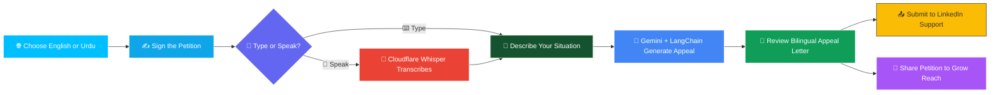

<div align="center">


<br/>


<br/>

[](https://awaaz-pakistan.vercel.app/en)
[](https://nextjs.org/)
[](LICENSE)
[](https://github.com/AbdulAzeemHashmi/Awaaz-Pakistan/pulls)
[](https://github.com/AbdulAzeemHashmi)

<br/>


&nbsp;

&nbsp;


<br/><br/>

> 🎯 **Awaaz Pakistan** is a community driven advocacy platform helping Pakistani professionals regain access to restricted LinkedIn accounts, through collective petitions, AI generated bilingual appeal letters, and voice input support. Built entirely on free infrastructure. Zero credit card required.

<br/>

[🔗 Live Demo](https://awaaz-pakistan.vercel.app/en) &nbsp;•&nbsp; [🐙 Repository](https://github.com/AbdulAzeemHashmi/Awaaz-Pakistan) &nbsp;•&nbsp; [⭐ Star This Repo](https://github.com/AbdulAzeemHashmi/Awaaz-Pakistan/stargazers)

</div>

<div align="center">

</div>

---

## 📋 Table of Contents

| # | Section |
|:--|:--------|
| 01 | [🚫 The Problem](#-the-problem) |
| 02 | [💡 The Solution](#-the-solution) |
| 03 | [🔄 How It Works](#-how-it-works) |
| 04 | [🚀 Live Demo](#-live-demo) |
| 05 | [🎯 Features](#-features) |
| 06 | [🛠️ Tech Stack](#️-tech-stack) |
| 07 | [📁 Project Structure](#-project-structure) |
| 08 | [⚙️ Setup and Installation](#️-setup-and-installation) |
| 09 | [🔑 Environment Variables](#-environment-variables) |
| 10 | [🗄️ Database Schema](#️-database-schema) |
| 11 | [☁️ Deployment](#️-deployment) |
| 12 | [🤝 How to Contribute](#-how-to-contribute) |
| 13 | [📄 License](#-license) |
| 14 | [🙏 Acknowledgments](#-acknowledgments) |

---

## 🚫 The Problem

<div align="center">

```
🔒 LinkedIn requires an NFC enabled e-Passport to restore restricted accounts.
📊 Estimated 99% of Pakistanis do NOT hold one.
🇵🇰 CNIC (NADRA verified, globally trusted) is simply not accepted.
```

</div>

<div align="center">

| Reality | Impact |
|:--------|:-------|
| 🔒 Persona verification requires an NFC chip passport | Thousands of professionals locked out permanently |
| 📊 ~99% of Pakistani passports have no NFC chip | The standard appeal path excludes nearly everyone |
| 🪪 CNIC is issued and verified by NADRA and trusted globally | Yet LinkedIn refuses it as a valid identity document |
| 🗣️ No accessible alternative path to appeal | Lost careers, networks, and income with no recourse |

</div>

> ⚠️ This is not a niche inconvenience. It is a systemic barrier shutting an entire country's workforce out of the world's largest professional network.

---

## 💡 The Solution

**Awaaz Pakistan** gives affected professionals a real, actionable path forward.

| Feature | Description |
|:--------|:------------|
| ✍️ **Collective Petition** | Sign alongside thousands to demand LinkedIn accept CNICs and NADRA verified documents |
| 🤖 **AI Appeal Letters** | Powered by Gemini API and LangChain, generated instantly in English or Urdu |
| 🎤 **Voice Input** | Speak your situation instead of typing, powered by Cloudflare Workers AI Whisper |
| 🌐 **Full Bilingual UI** | Complete Urdu RTL rendering, not a bolted on translation |
| 💰 **Zero Cost Infrastructure** | Built entirely on free tiers, no credit card required to run or contribute |

📌 The goal is simple: turn thousands of individual, ignored complaints into one loud, well documented, unified voice that LinkedIn cannot ignore.

---

## 🔄 How It Works

<div align="center">



</div>

**Step by Step:**

1. 🌐 **Choose your language**, English or Urdu, and the entire interface adapts including RTL layout for Urdu
2. ✍️ **Sign the petition** with your name and message, adding to the collective count
3. 🎤 **Input your situation** by typing your story or speaking it directly and letting Whisper transcribe
4. 🤖 **Gemini generates** a professional, bilingual appeal letter tailored to your specific situation
5. 📤 **Submit the letter** directly to LinkedIn support with one click
6. 📢 **Share the petition** to grow reach and pressure LinkedIn into accepting NADRA documents

---

## 🚀 Live Demo

<div align="center">

### 🔗 [awaaz-pakistan.vercel.app/en](https://awaaz-pakistan.vercel.app/en)

[](https://awaaz-pakistan.vercel.app/en)

</div>

> 🌐 The live app includes a full language switcher between English and Urdu with complete RTL layout mirroring. Try switching languages on the demo to see the bilingual experience in action.

---

## 🎯 Features

<div align="center">

| Feature | Icon | Description |
|:--------|:----:|:------------|
| **Petition Signing** | ✍️ | Sign the petition with a real time signature counter |
| **AI Appeal Generation** | 🤖 | Generate a professional appeal letter in English or Urdu instantly |
| **Voice Input** | 🎤 | Speak your appeal and have it converted to text automatically |
| **Language Switcher** | 🌐 | Toggle between English and Urdu at any time on any page |
| **Urdu RTL Support** | 🔄 | Full right to left rendering for a native Urdu reading experience |
| **Social Sharing** | 📢 | Share the petition directly to social platforms to grow visibility |
| **Support Request Generator** | 📝 | Generate a pre formatted request ready to submit to LinkedIn support |
| **Zero Cost Infrastructure** | 💰 | Runs entirely on free tier services, no credit card required |

</div>

🎉 Every feature above is live and functional on the deployed demo.

---

## 🛠️ Tech Stack

<div align="center">

| Technology | Purpose | Free Tier |
|:-----------|:--------|:----------|
| ⚡ **Next.js 16** (App Router) with TypeScript | Full stack framework and routing | ✅ Open source |
| ☁️ **Vercel** | Hosting and deployment | ✅ Free, no credit card |
| 🗄️ **Supabase PostgreSQL** | Database for signatures and stats | ✅ Free tier project |
| 🤖 **Google Gemini API + LangChain** | AI powered appeal generation | ✅ Free tier quota |
| 🎤 **Cloudflare Workers AI Whisper** | Speech to text for voice input | ✅ Free Workers AI |
| 🈯 **LibreTranslate** | Open source translation support | ✅ Fully open source |
| 🌐 **next-intl** | Internationalization with Urdu RTL | ✅ Open source library |
| 💅 **Tailwind CSS v4** | Styling and design system | ✅ Open source |

<br/>


&nbsp;

&nbsp;

&nbsp;

&nbsp;

&nbsp;


</div>

---

## 📁 Project Structure

```
Awaaz-Pakistan/
├── 📂 app/
│   ├── 📂 [locale]/                # Locale scoped routes (en, ur)
│   │   ├── page.tsx                # Landing page and petition form
│   │   ├── 📂 appeal/              # AI appeal generator flow
│   │   └── layout.tsx              # Locale aware layout with RTL support
│   └── 📂 api/
│       ├── 📂 sign/                # Petition signature endpoint
│       ├── 📂 generate-appeal/     # Gemini + LangChain appeal generation
│       └── 📂 voice/               # Cloudflare Whisper voice transcription proxy
│
├── 📂 components/                  # Shared UI components
├── 📂 lib/
│   ├── supabase.ts                 # Supabase client setup
│   ├── gemini.ts                   # Gemini and LangChain integration
│   └── i18n.ts                     # next-intl configuration
│
├── 📂 messages/
│   ├── en.json                     # English translation strings
│   └── ur.json                     # Urdu translation strings
│
├── 📂 workers/
│   └── 📂 whisper-worker/          # Cloudflare Worker for speech to text
│
├── 📂 database/
│   └── schema.sql                  # Supabase table definitions
│
├── 🔒 .env.example                 # Template for required variables
├── 📦 package.json                 # Project dependencies
└── 📘 README.md                    # You are here
```

**Key folders explained:**

- `app/[locale]/` keeps every page locale aware so English and Urdu routes share the same components but render with the correct language and text direction
- `lib/` centralizes all third party integrations: Supabase, Gemini, and internationalization
- `workers/whisper-worker/` is a standalone Cloudflare Worker deployed separately from the main Next.js app
- `database/schema.sql` is the single source of truth for the Supabase table structure

---

## ⚙️ Setup and Installation

### ✅ Prerequisites

- 🟢 Node.js v18 or later
- 📦 npm or yarn
- 🗄️ A free Supabase account and project ([supabase.com](https://supabase.com))
- 🔑 A free Google Gemini API key ([aistudio.google.com](https://aistudio.google.com))
- ☁️ A free Cloudflare account with Workers AI enabled ([cloudflare.com](https://cloudflare.com))

<details open>
<summary><b>1️⃣ Clone the Repository</b></summary>
<br/>

```bash
git clone https://github.com/AbdulAzeemHashmi/Awaaz-Pakistan.git
cd Awaaz-Pakistan
```

</details>

<details open>
<summary><b>2️⃣ Install Dependencies</b></summary>
<br/>

```bash
npm install
```

</details>

<details open>
<summary><b>3️⃣ Configure Environment Variables</b></summary>
<br/>

```bash
cp .env.example .env.local
```

Fill in the values described in the [Environment Variables](#-environment-variables) section below.

</details>

<details open>
<summary><b>4️⃣ Set Up the Database</b></summary>
<br/>

Run the SQL from the [Database Schema](#️-database-schema) section inside your Supabase SQL editor.

</details>

<details open>
<summary><b>5️⃣ Run the Development Server</b></summary>
<br/>

```bash
npm run dev
```

Open [http://localhost:3000](http://localhost:3000) in your browser. 🎉

</details>

---

## 🔑 Environment Variables

<div align="center">

| Variable | Description | Where to Get It |
|:---------|:------------|:----------------|
| `GEMINI_API_KEY` | Your Gemini API key | Google AI Studio, aistudio.google.com |
| `NEXT_PUBLIC_SUPABASE_URL` | Supabase project URL | Supabase Dashboard then Settings then API |
| `NEXT_PUBLIC_SUPABASE_ANON_KEY` | Supabase anon public key | Supabase Dashboard then Settings then API |
| `NEXT_PUBLIC_CLOUDFLARE_WORKER_URL` | Cloudflare Worker URL | Cloudflare Workers Dashboard after deploying |

</div>

```env
GEMINI_API_KEY=your_gemini_api_key_here
NEXT_PUBLIC_SUPABASE_URL=https://your-project.supabase.co
NEXT_PUBLIC_SUPABASE_ANON_KEY=your_supabase_anon_key_here
NEXT_PUBLIC_CLOUDFLARE_WORKER_URL=https://your-worker.your-subdomain.workers.dev
```

> ⚠️ **Never commit your `.env.local` file.** It is already excluded via `.gitignore`.

---

## 🗄️ Database Schema

Awaaz Pakistan uses two tables in Supabase: one for individual petition signatures, and one for fast aggregate stats.

<details open>
<summary><b>📋 Run this SQL in your Supabase SQL editor</b></summary>
<br/>

```sql
-- Stores every individual petition signature
create table signatures (
  id          uuid primary key default gen_random_uuid(),
  full_name   text not null,
  email       text not null,
  city        text,
  message     text,
  language    text default 'en',
  created_at  timestamptz default now()
);

-- Stores aggregate petition statistics for fast counter reads
create table petition_stats (
  id               int primary key default 1,
  total_signatures int default 0,
  updated_at       timestamptz default now()
);

-- Enable Row Level Security
alter table signatures enable row level security;
alter table petition_stats enable row level security;

-- Allow public inserts for new signatures
create policy "Allow public insert" on signatures
  for insert with check (true);

-- Allow public read access to stats
create policy "Allow public read" on petition_stats
  for select using (true);
```

</details>

<div align="center">

| Table | Column | Type | Description |
|:------|:-------|:-----|:------------|
| `signatures` | `id` | uuid | Primary key, auto generated |
| `signatures` | `full_name` | text | Signer's full name |
| `signatures` | `email` | text | Signer's email address |
| `signatures` | `city` | text | Optional city |
| `signatures` | `message` | text | Optional personal message |
| `signatures` | `language` | text | UI language at time of signing (en or ur) |
| `signatures` | `created_at` | timestamptz | Timestamp of the signature |
| `petition_stats` | `total_signatures` | int | Running aggregate count for fast reads |

</div>

---

## ☁️ Deployment

<details open>
<summary><b>🚀 Deploy the Next.js App to Vercel</b></summary>
<br/>

1. 📤 Push your fork to GitHub
2. 📥 Import the repository at [vercel.com/new](https://vercel.com/new)
3. 🔑 Add all four environment variables in the Vercel project settings
4. ⚙️ Vercel auto detects Next.js and configures the build
5. 🚀 Click **Deploy**

</details>

<details open>
<summary><b>🎤 Deploy the Cloudflare Whisper Worker</b></summary>
<br/>

```bash
cd workers/whisper-worker
npm install -g wrangler
wrangler login
wrangler deploy
```

Copy the deployed Worker URL into `NEXT_PUBLIC_CLOUDFLARE_WORKER_URL` in your environment variables.

</details>

<details open>
<summary><b>🗄️ Set Up Supabase</b></summary>
<br/>

1. 🆕 Create a new free project at [supabase.com](https://supabase.com)
2. 📋 Open the SQL editor and run the schema from the [Database Schema](#️-database-schema) section
3. 🔑 Copy your project URL and anon key into your environment variables

</details>

---

## 🤝 How to Contribute

Contributions are welcome and genuinely appreciated. This project exists because of community effort, and it grows the same way. 💪

### 🐛 Reporting Issues

- 🔍 Search existing issues first to avoid duplicates
- 📝 Include clear steps to reproduce, expected behavior, and actual behavior
- 🖼️ Screenshots help a lot, especially for UI or RTL rendering bugs

### 🔀 Submitting Pull Requests

1. 🍴 Fork the repository
2. 🌿 Create a feature branch: `git checkout -b feature/your-feature-name`
3. 💻 Make your changes and commit clearly: `git commit -m "feat: add your feature"`
4. 🔀 Push to your branch: `git push origin feature/your-feature-name`
5. 📬 Open a Pull Request describing what changed and why

> 💡 Translation improvements for Urdu accuracy and RTL layout fixes are especially welcome!

---

## 📄 License

This project is licensed under the **MIT License**. See the [LICENSE](./LICENSE) file for full details.

---

## 🙏 Acknowledgments

- 🇵🇰 Every Pakistani professional who shared their story and pushed this problem into the open
- 🤖 **Google Gemini** and **LangChain** for making AI powered appeal generation possible at zero cost
- 🗄️ **Supabase** for a fast, free, and reliable database
- ☁️ **Cloudflare Workers AI** for free, low latency speech to text via Whisper
- 🈯 **LibreTranslate** for open source translation support
- ▲ **Vercel** for effortless, free Next.js hosting
- 🏆 The open source community whose tools made a zero cost advocacy platform possible

---

<div align="center">

### 👨‍💻 Built by Abdul Azeem Hashmi

[](https://github.com/AbdulAzeemHashmi)

<br/>

**⭐ If Awaaz Pakistan matters to you, star the repo and help it reach more people.**

<a href="https://github.com/AbdulAzeemHashmi/Awaaz-Pakistan/stargazers">

</a>

<br/><br/>

🚀 **Every voice added makes this louder.** 🇵🇰


</div>